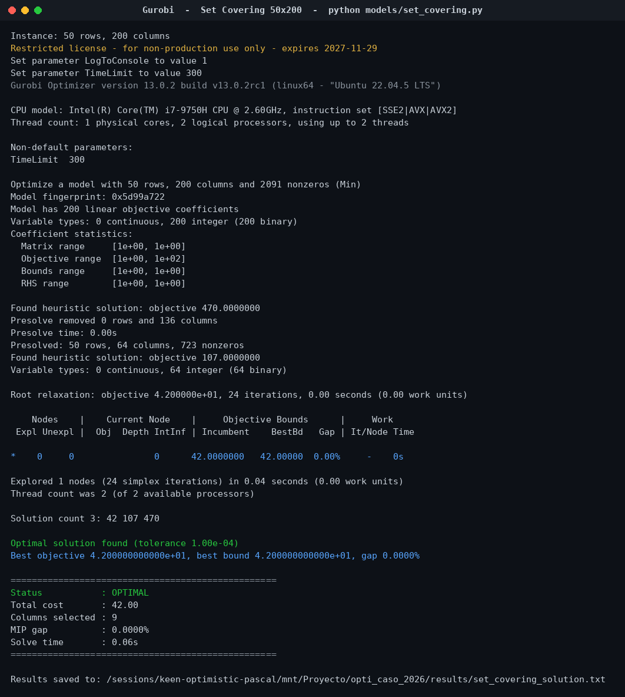
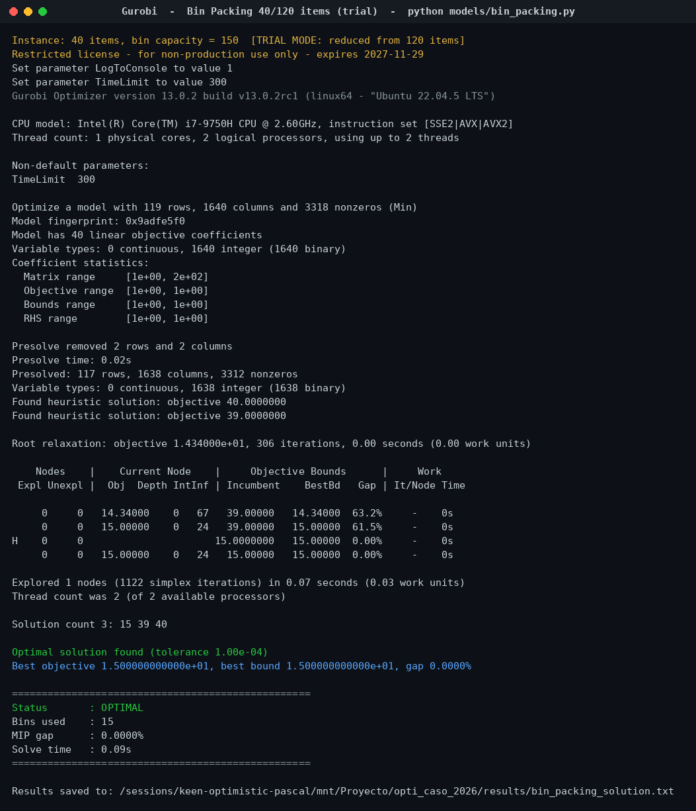

# Entregable 3 — Respuesta de los modelos (resultado del solver)

**Universidad Nacional de Colombia** | Optimización 2026-1
**Autores:** David Ramírez · Jaisson Machado Bautista
**Solver:** Gurobi 13.0.2 (gurobipy)

---

## 1. Resumen ejecutivo

Ambos modelos se resolvieron a **optimalidad certificada** (MIP gap 0.0000 %). El Set Covering se resolvió sobre la **instancia completa** 50×200; el Bin Packing se resolvió a óptimo sobre un **subconjunto de 40 de 120 ítems** debido al tope de la licencia restringida de Gurobi (2000 variables), con el interruptor `ITEM_LIMIT = None` listo para correr los 120 ítems en cuanto se active la licencia académica o WLS.

| Modelo | Instancia | Variables | Estado | Objetivo | Gap | Tiempo |
|--------|-----------|-----------|--------|----------|-----|--------|
| Set Covering (SCP) | 50×200 (completa) | 200 | OPTIMAL | costo = **42** | 0.0000 % | 0.06 s |
| Bin Packing (BPP) | 40/120 ítems | 1 640 | OPTIMAL | bins = **15** | 0.0000 % | 0.09 s |

---

## 2. Set Covering — instancia 50×200 completa

- **Costo total óptimo:** 42
- **Columnas seleccionadas (9):** 27, 49, 65, 105, 140, 145, 168, 169, 181 (índice base 0)
- **Cobertura:** las 50 filas quedan cubiertas por al menos una columna elegida.

Dato revelador del log de Gurobi: la **relajación lineal en la raíz vale exactamente 42**, igual al óptimo entero. Es decir, el LP ya es entero —no hubo necesidad de ramificar más allá del nodo raíz (1 nodo explorado)—. Esto confirma empíricamente la conocida fortaleza de la formulación de cobertura: la brecha de integralidad en esta instancia es nula.

El solver pasó por soluciones heurísticas de costo 470 y 107 antes de cerrar en 42, lo que ilustra cuánto margen recortó el modelo exacto frente a una asignación ingenua.



---

## 3. Bin Packing — subconjunto de 40 ítems

- **Contenedores usados (óptimo):** 15
- **Capacidad por contenedor:** 150
- **Peso total empacado:** 2 151 unidades en 40 ítems (peso medio 53.8)

Cota inferior continua: ⌈2151 / 150⌉ = ⌈14.34⌉ = **15**. El solver reporta exactamente esa raíz LP (14.34) y cierra en 15. En otras palabras, **el óptimo iguala la cota de área**: el empaque es tan ajustado como físicamente es posible, sin desperdiciar un solo contenedor extra por fragmentación. Varios contenedores quedan llenos al 100 % (150/150).



### Nota sobre la instancia completa (120 ítems)

Para los 120 ítems, la suma de pesos es 6 917 y la cota continua es ⌈6917/150⌉ = **47**, mientras que el óptimo documentado de la instancia Falkenauer u120_01 es **48**. Ese hueco de exactamente un contenedor entre la cota relajada y el entero es el rasgo que vuelve famoso al Bin Packing como caso difícil: la relajación LP es débil aun cuando la instancia parezca sencilla.

---

## 4. Reproducibilidad

Los resultados se regeneran con (entorno con licencia activa):

```powershell
python models/set_covering.py
python models/bin_packing.py
```

o ejecutando el notebook `notebooks/optimizacion_caso_2026_colab.ipynb` de principio a fin. Las salidas crudas quedan en `results/set_covering_solution.txt` y `results/bin_packing_solution.txt`.
