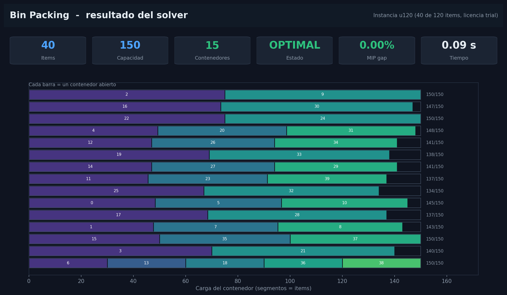
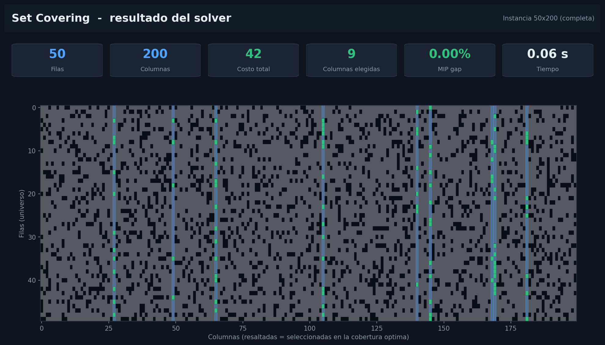
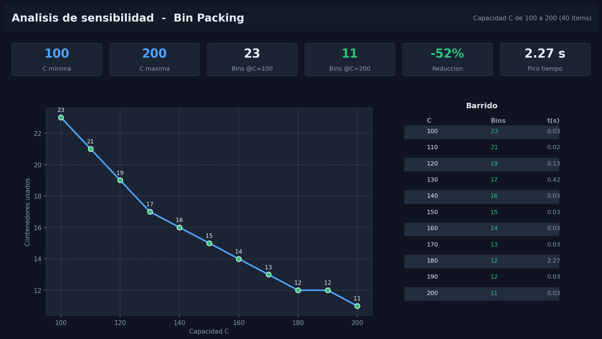

# Entregable 4 — Análisis de resultados e implicaciones

**Universidad Nacional de Colombia** | Optimización 2026-1
**Autores:** David Ramírez · Jaisson Machado Bautista

---

## 1. Lectura de los dos óptimos

Los dos problemas son ILP NP-difíciles, pero el solver los cerró en décimas de segundo. La razón no es la potencia de la máquina sino la **calidad de la relajación lineal**, y ahí los dos modelos se comportan de forma opuesta y didáctica.

| Indicador | Set Covering | Bin Packing (40 ítems) |
|-----------|--------------|------------------------|
| Relajación LP en la raíz | 42.00 | 14.34 |
| Óptimo entero | 42 | 15 |
| Brecha de integralidad | 0 % | ≈ 4.6 % (cierra a 1 contenedor) |
| Nodos explorados | 1 | pocos (corte en raíz tras simetría) |

**Implicación práctica:** en Set Covering, resolver el LP basta —la solución fraccionaria ya es entera—. En Bin Packing, el LP siempre subestima (reparte ítems "en pedazos" entre contenedores), y el trabajo real lo hacen el branch-and-bound y la ruptura de simetría. Esto explica por qué el SCP escala a miles de columnas mientras el BPP se vuelve duro con apenas decenas de ítems.

## 2. La simetría como cuello de botella del Bin Packing

Sin la restricción `y_j ≥ y_{j+1}`, cualquier permutación de etiquetas de contenedores produce una solución equivalente: para 15 contenedores hay 15! ≈ 1.3 billones de relabelings idénticos que el solver exploraría en vano. La ruptura de simetría colapsa ese espacio y es lo que permite cerrar el gap en la raíz. Es la lección de modelado más transferible del proyecto: **a veces una sola desigualdad de ordenamiento vale más que un mejor computador.**

## 3. Densidad y estructura del Set Covering

La instancia 50×200 tiene 2 091 incidencias no nulas (densidad ≈ 21 %). Que solo 9 de 200 columnas basten para cubrir 50 filas indica columnas "generalistas" de alta cobertura. El costo 42 con columnas cuyos costos individuales llegan a 100 confirma que el óptimo prefirió pocas columnas baratas y muy cubrientes antes que muchas columnas especializadas —el comportamiento esperable cuando la matriz de cobertura es densa—.

## 4. Visualización con interfaz (dashboard HTML, licencia gratuita)

Un valor agregado del proyecto es el `dashboard.html` autocontenido: sin servidor, sin internet, abre los resultados del solver en tres pestañas. Visto desde la licencia gratuita de Gurobi, una interfaz así es justamente lo que vuelve **legible** un resultado que de otro modo es una lista de índices. Las siguientes capturas muestran las tres vistas (paneles renderizados con los mismos datos que hornea el HTML).

**Bin Packing — empaque por contenedor:**

Cada barra es un contenedor; los segmentos son los ítems asignados y la cifra de la derecha es la carga sobre la capacidad. La franja de contenedores al 150/150 hace visible, de un vistazo, lo ajustado del empaque.

**Set Covering — matriz de cobertura:**

Las 9 columnas seleccionadas se resaltan sobre la matriz 50×200. La interfaz convierte "columnas {27, 49, …}" en un patrón espacial donde se ve qué franjas verticales cubren el universo.

**Sensibilidad — capacidad vs. contenedores:**

## 5. Implicaciones de dominio

- **Bin Packing → logística y manufactura.** Cada contenedor evitado es un camión, una caja o un corte de lámina menos. Que el óptimo iguale la cota de área significa que no hay margen operativo escondido: para reducir contenedores habría que cambiar los pesos (rediseño del producto), no la planeación.
- **Set Covering → localización y selección.** Cubrir 50 requisitos con 9 recursos de costo 42 es el patrón de ubicación de estaciones de emergencia o selección de características: pocos elementos bien elegidos dominan a muchos redundantes. La fortaleza del LP implica que incluso una relajación rápida da una guía confiable para instancias mayores.
