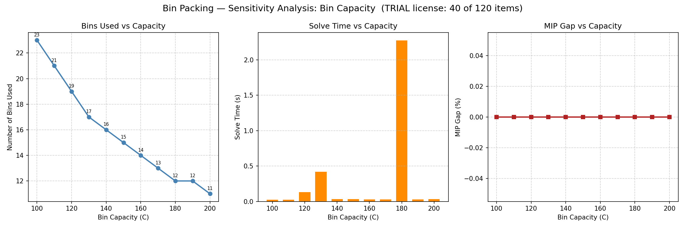

# Entregable 5 — Análisis de sensibilidad

**Universidad Nacional de Colombia** | Optimización 2026-1
**Autores:** David Ramírez · Jaisson Machado Bautista
**Problema analizado:** Bin Packing (parámetro: capacidad del contenedor *C*)

---

## 1. Diseño del experimento

Se varió la capacidad *C* de **100 a 200 en pasos de 10** (11 escenarios), resolviendo el BPP a optimalidad en cada punto sobre el mismo conjunto de 40 ítems. Se registró contenedores usados, tiempo de solución y MIP gap. Todos los puntos cerraron con gap 0 %.

| Capacidad *C* | Contenedores | Tiempo (s) | Gap |
|---------------|--------------|------------|-----|
| 100 | 23 | 0.03 | 0 % |
| 110 | 21 | 0.02 | 0 % |
| 120 | 19 | 0.13 | 0 % |
| 130 | 17 | 0.42 | 0 % |
| 140 | 16 | 0.03 | 0 % |
| 150 | 15 | 0.03 | 0 % |
| 160 | 14 | 0.03 | 0 % |
| 170 | 13 | 0.03 | 0 % |
| 180 | 12 | **2.27** | 0 % |
| 190 | 12 | 0.03 | 0 % |
| 200 | 11 | 0.03 | 0 % |



---

## 2. Dos hallazgos, no uno

**(a) La respuesta estructural es suave y casi lineal.** Al pasar *C* de 100 a 200, los contenedores caen de 23 a 11 —una reducción del 52 %—, de manera monótona. Coincide con la intuición de área: contenedores ≈ peso_total / *C* = 2151 / *C*, que para *C*=100 da 21.5 (óptimo 23) y para *C*=200 da 10.8 (óptimo 11). El óptimo entero sigue de cerca a la cota continua, con uno o dos contenedores de holgura por fragmentación. Nótese la **meseta en *C* = 180 y 190 (ambos 12 contenedores)**: ampliar la capacidad no siempre compra un contenedor menos; hay tramos donde el peso indivisible de los ítems impide aprovechar el espacio extra.

**(b) El costo computacional NO es monótono.** Aquí está lo interesante. El tiempo de solución no crece ni decrece con *C*: explota en puntos aislados —*C*=130 (0.42 s) y sobre todo *C*=180 (2.27 s, ~75× la mediana)—. Estos picos ocurren en capacidades donde la solución entera queda **al filo de la cota fraccionaria**: el branch-and-bound debe trabajar para descartar el contenedor de más. En las capacidades "cómodas", el redondeo de la cota basta y el solver cierra en la raíz.

## 3. Implicación

La dificultad del Bin Packing no vive en el tamaño nominal del problema sino en la **aritmética entre los pesos y la capacidad**. Un gestor de logística que pueda elegir el tamaño de contenedor debería evitar las capacidades "de frontera" (como 180 aquí): no solo rinden poco en reducción de unidades, sino que son las más caras de optimizar. La sensibilidad, entonces, no es solo sobre *cuántos* contenedores, sino sobre *cuánto cuesta decidirlo* —una distinción que un análisis de solo-resultados pasaría por alto—.

## 4. Reproducción

```powershell
python sensitivity/sensitivity_analysis.py
```

Genera `results/sensitivity_capacity.png` y `results/sensitivity_summary.csv`. La misma sección está en el notebook de Colab (apartado 4).
